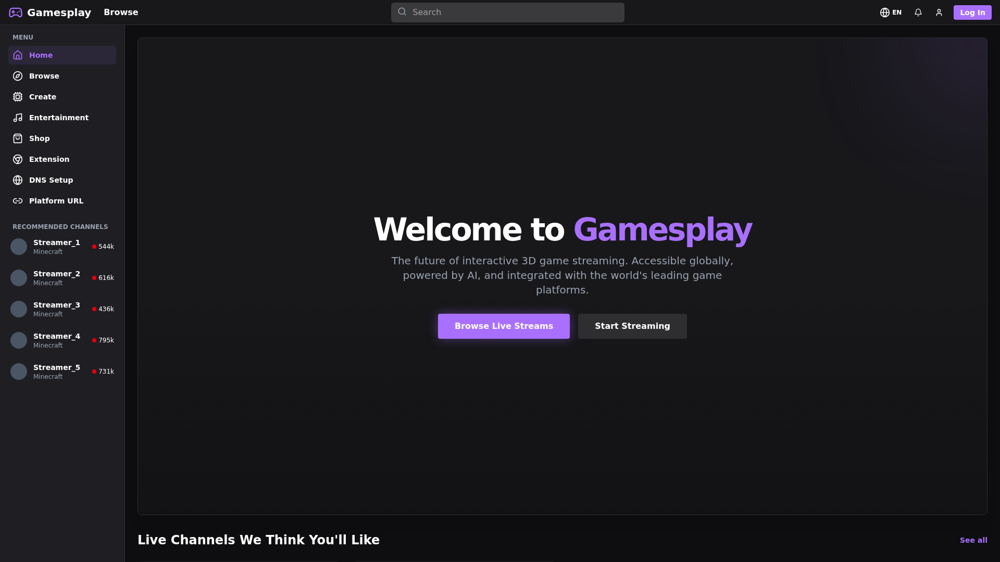
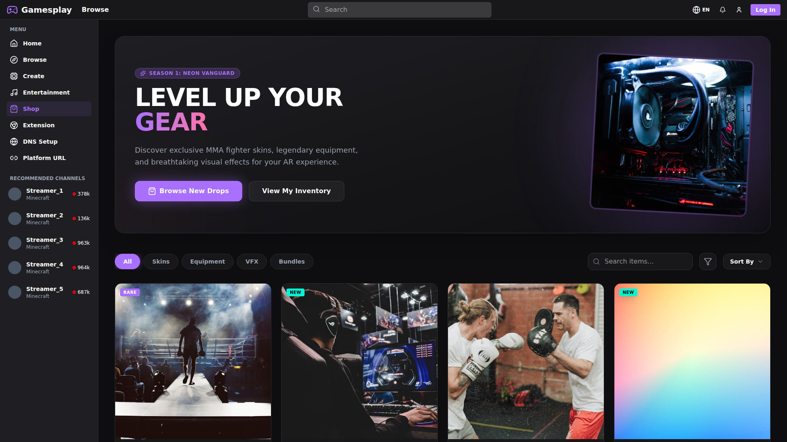

# Gamesplay

Gamesplay is a dedicated channel for streaming and playing games. It provides a platform for gamers to share their experiences and enjoy a wide variety of gaming content.

**Official Website:** [https://gamesplay.tv](https://gamesplay.tv)

## Platform Preview

| Home Page | Shop Page |
| :---: | :---: |
|  |  |

## Features

- **Live Streaming**: Stream your favorite games to a global audience.
- **MMA AR Game**: Immersive mixed martial arts experience using Augmented Reality.
- **AI-Powered Gameplay**: Intelligent agents and computer vision for enhanced interaction.
- **Blockchain Economy**: Secure in-game assets, NFTs, and decentralized rewards.
- **High Performance**: Optimized for a smooth 3D gaming and streaming experience.

## Roadmap & Integration

We are currently expanding Gamesplay to include cutting-edge technologies. For a detailed roadmap and technical strategy, please see our [Integration Plan](INTEGRATION_PLAN.md).

### Key Upcoming Features
- **MMA AR Integration**: Bringing the octagon to your living room.
- **AI Agents**: Competitive AI that adapts to your fighting style.
- **Web3 Components**: Play-to-earn mechanics and collectible MMA NFTs.

## Getting Started

### Prerequisites

- A modern web browser (Chrome, Firefox, or Edge recommended)
- A stable internet connection

### Installation

No installation is required. Simply visit our website and start playing or streaming.

## Usage

1. **Sign Up**: Create an account to save your progress and start streaming.
2. **Browse Games**: Explore our extensive library of games.
3. **Go Live**: Set up your stream and share your gameplay with others.

## Contributing

We welcome contributions! If you'd like to contribute, please follow these steps:

1. Fork the repository.
2. Create a new branch (`git checkout -b feature/your-feature`).
3. Commit your changes (`git commit -m 'Add some feature'`).
4. Push to the branch (`git push origin feature/your-feature`).
5. Open a pull request.

## License

This project is licensed under the MIT License - see the [LICENSE](LICENSE) file for details.

## Security

For security information, please refer to our [Security Policy](SECURITY.md).
